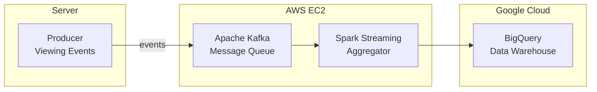
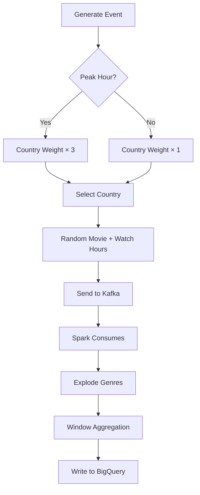
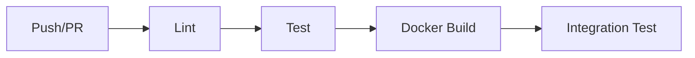
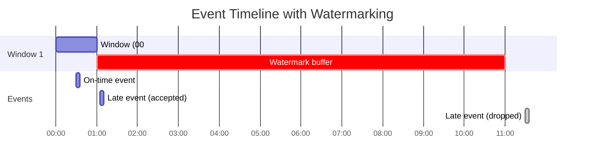

# Global Content Trending Analysis Platform

A real-time streaming analytics platform that simulates Netflix viewing patterns across 10 countries, processes events through Apache Kafka, aggregates data using PySpark Structured Streaming, and writes results to Google BigQuery.

## Architecture



### Data Flow



## Features

### Kafka Producer (`workspace/producer.py`)
- **Weighted Country Distribution**: Simulates 2026 Netflix subscriber distribution across 10 countries (US: 81M, UK: 18M, DE: 16M, etc.)
- **Timezone-Aware Country Weighting**: Countries in local evening hours (20:00-23:00) have 3x higher probability of being selected
- **Batch Event Generation**: Sends 2-5 events per batch every 2 seconds (~151K events/day)
- **Movie Metadata Integration**: Loads movie data with multi-genre support from CSV

### Spark Streaming Aggregator (`workspace/streaming_aggregator.py`)
- **Watermarking**: 10-minute watermark for handling late-arriving events
- **Tumbling Windows**: 1-minute aggregation windows grouped by country and genre
- **Multi-Genre Support**: Explodes comma-separated genres into individual rows
- **Dual Output Mode**: Console (development) or BigQuery (production)

### Infrastructure
- **Docker Compose**: Unified configuration for local dev and AWS EC2
- **CI/CD Pipeline**: GitHub Actions for linting, testing, building, and deployment
- **UV Package Manager**: Modern Python dependency management

## Project Structure

```
├── workspace/
│   ├── producer.py              # Kafka event producer
│   └── streaming_aggregator.py  # Spark streaming consumer
├── data/
│   └── titles_metadata.csv      # Movie metadata (Top 100 movies)
├── scripts/
│   ├── run_producer.sh          # Run producer (on-premise)
│   └── run_spark.sh             # Run Spark job (EC2)
├── tests/
│   └── test_producer.py         # Unit tests
├── docker-compose.yml           # Kafka + Spark stack (local & AWS)
├── Dockerfile                   # Multi-stage build
├── pyproject.toml               # UV dependencies
└── .github/workflows/ci.yml     # CI/CD pipeline
```

### Peak Hour Simulation

The producer simulates realistic viewing patterns using **timezone-aware country weighting**:

| Country | Base Weight | Timezone | Peak Hours (Local) |
|---------|-------------|----------|-------------------|
| US | 81 | America/New_York | 20:00 - 23:00 |
| UK | 18 | Europe/London | 20:00 - 23:00 |
| DE | 16 | Europe/Berlin | 20:00 - 23:00 |
| BR | 16 | America/Sao_Paulo | 20:00 - 23:00 |
| MX | 14 | America/Mexico_City | 20:00 - 23:00 |
| FR | 13 | Europe/Paris | 20:00 - 23:00 |
| IN | 12 | Asia/Kolkata | 20:00 - 23:00 |
| CA | 9 | America/Toronto | 20:00 - 23:00 |
| JP | 9 | Asia/Tokyo | 20:00 - 23:00 |
| KR | 8 | Asia/Seoul | 20:00 - 23:00 |

**How it works:**
- Event generation rate is **fixed** (2-5 events every 2 seconds)
- Countries in peak hours (20:00-23:00 local time) have **3x higher probability** of being selected
- This simulates real-world behavior where evening hours have higher viewership

**Example:** When it's 21:00 in Tokyo (peak) and 07:00 in New York (off-peak):
- Japan's effective weight: 9 × 3 = **27**
- USA's effective weight: 81 × 1 = **81**
- Japan events become more likely relative to its base weight

## Data Schema

### Kafka Event
```json
{
  "user_id": "user_00001",
  "movie_id": "m001",
  "country": "US",
  "genre": "Action,Drama",
  "watch_hours": 1.5,
  "timestamp": "2026-01-25T12:00:00+00:00"
}
```

### BigQuery Output
| Column | Type | Description |
|--------|------|-------------|
| `window_start` | TIMESTAMP | Aggregation window start |
| `window_end` | TIMESTAMP | Aggregation window end |
| `country` | STRING | Country code |
| `individual_genre` | STRING | Genre (exploded) |
| `total_watch_hours` | FLOAT | Sum of watch hours |
| `processed_at` | TIMESTAMP | Processing timestamp |


## CI/CD Pipeline



The GitHub Actions workflow (`.github/workflows/ci.yml`) includes:

1. **Lint**: Ruff linting and formatting check
2. **Test**: Pytest unit tests
3. **Docker Build**: Multi-stage image builds
4. **Integration Test**: Kafka connectivity test

## Watermarking Explained

The streaming aggregator uses a **10-minute watermark** to handle late-arriving events:



**Why events arrive late:**
- Network latency
- Mobile device connectivity issues
- International routing delays

**Watermark trade-off:**
| Setting | Pros | Cons |
|---------|------|------|
| Too short | Fast output | Drops late events |
| Too long | More accurate | High memory usage |
| **10 minutes** | Balanced | Good for dashboards |

